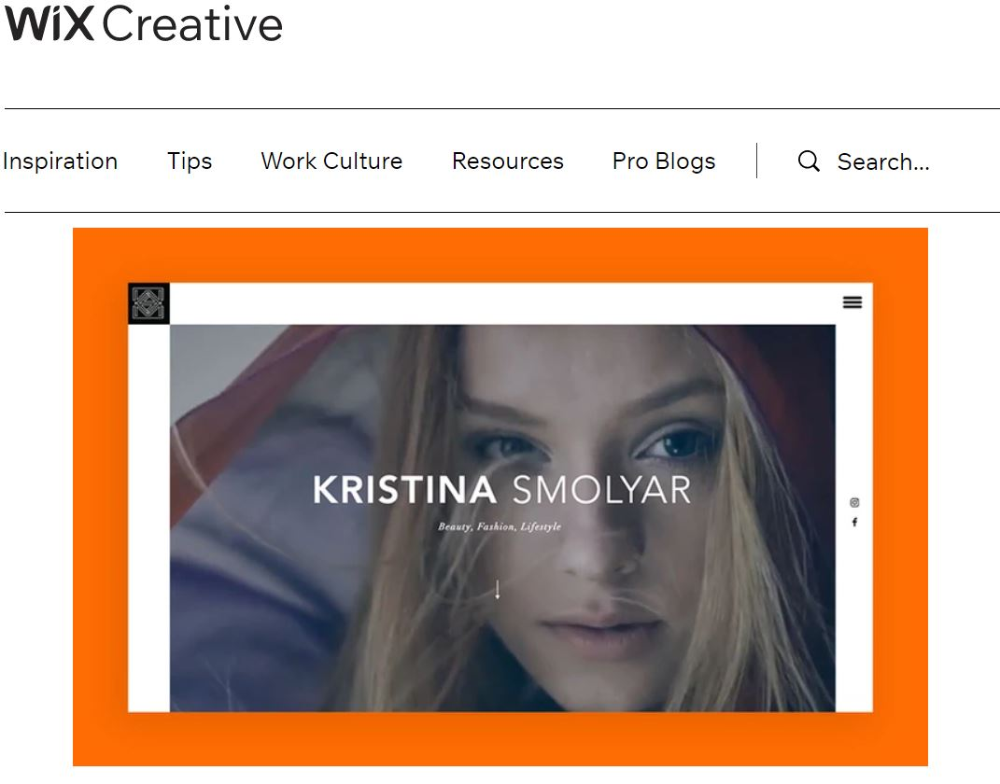

# Readme - Portfolio Project 
**Version 1.0 December 13, 2021**

## Intro

This portfolio website is the final project of the MTM6201 - Web Development II course

---

## Progress 
Working on this project has enlightened me a lot as I used the bootstrap library while coding, I had some challenges but I was able to overcome them. Working on bootstrap is an easier way of coding, however, what is important is to **know how to use the variables as well as to be familiar with the bootstrap classes**.

---

## Challenges
1. **No mockup:**
As I'm taking a reduced load of the program, I still didn't take the user experience design, however, I discussed this challenge with Prof.Abhay and he suggested to get some aspiration from online design which I did and I followed a design from [WIX designs](https://www.wix.com/blog/creative/2020/03/best-portfolio-websites?utm_source=google&utm_medium=cpc&utm_campaign=9766148092^99337316066&experiment_id=^^428880544304^^_DSA&gclid=Cj0KCQiA-qGNBhD3ARIsAO_o7ykKy0Ws9NVMmjB9_30gcYxUsLmvm6MXfn5SPvnb7L54f2LXFSyhntkaAmZZEALw_wcB). I had to add many item to it and change the color to make my website responsive and attractive, here's the **mockup image** 

2. **Bootstrap classes:**
Working on bootstrap was a bit challenging as I wasn't very familiar with its classes, however, by completing this project, I'm confident that I learned a lot and I'm not ready to use in my next project

---

## Libraries

I used two libraries in my project as follows:

[Bootstrap Library](https://getbootstrap.com/docs/5.1/getting-started/introduction/)

[icon font Library](https://cdn.jsdelivr.net/npm/bootstrap-icons@1.7.2/font/bootstrap-icons.css)

## Sample of included work 
**Coding**
[Three Media Website](https://alna0077.github.io/final-project/)

**WordPress site design**
[Low Carby Website](http://emadalnaji.ca/home/)

## Useful tools
I used some online tools to complete this project as follow:

**Image Resizing tool**
[Image Resize](https://derivv.com/)

**Logo Design**
[canva](https://www.canva.com/)

I used **canva** to create my logo 

